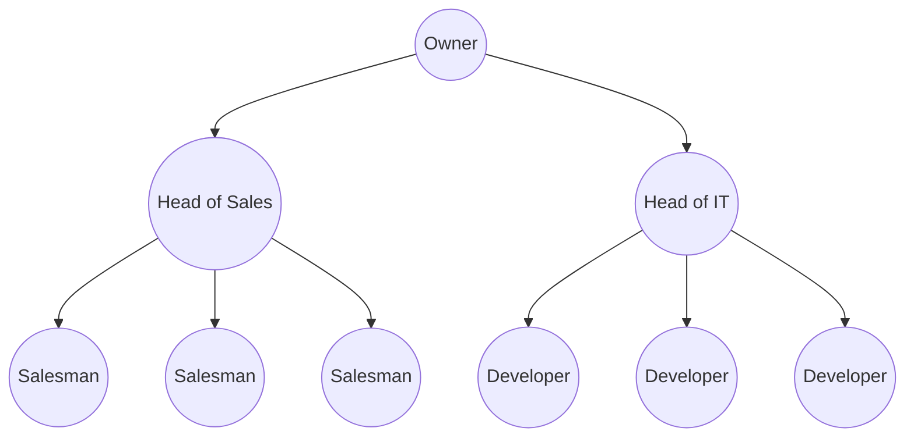

A tree structure is hierarchical data, in business world most common example would be a company hierarchy, but assuming that there is only one owner. Each employee would be a node, having a parent node with his own boss.

